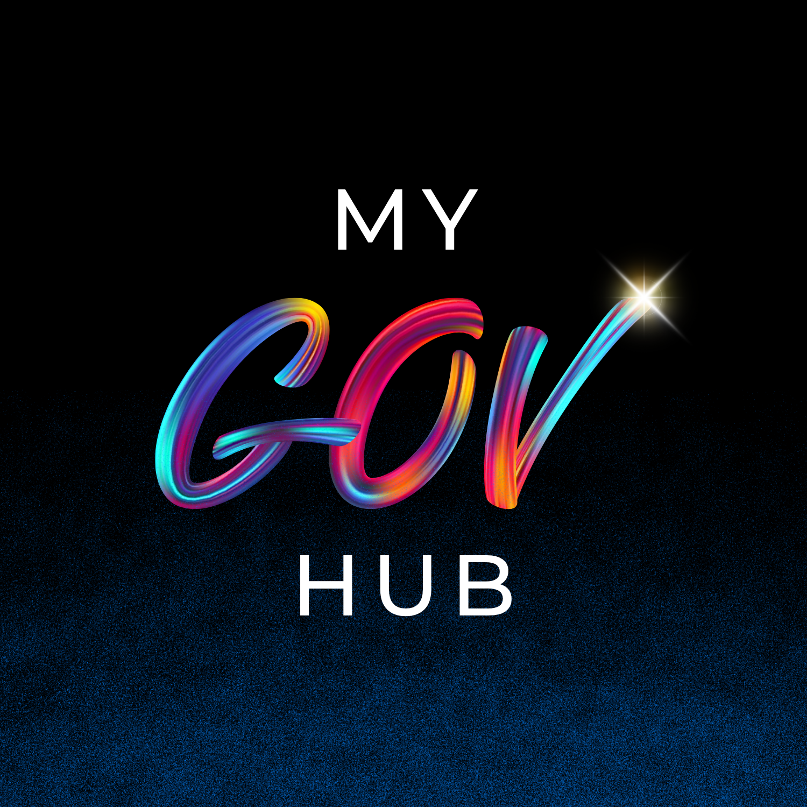
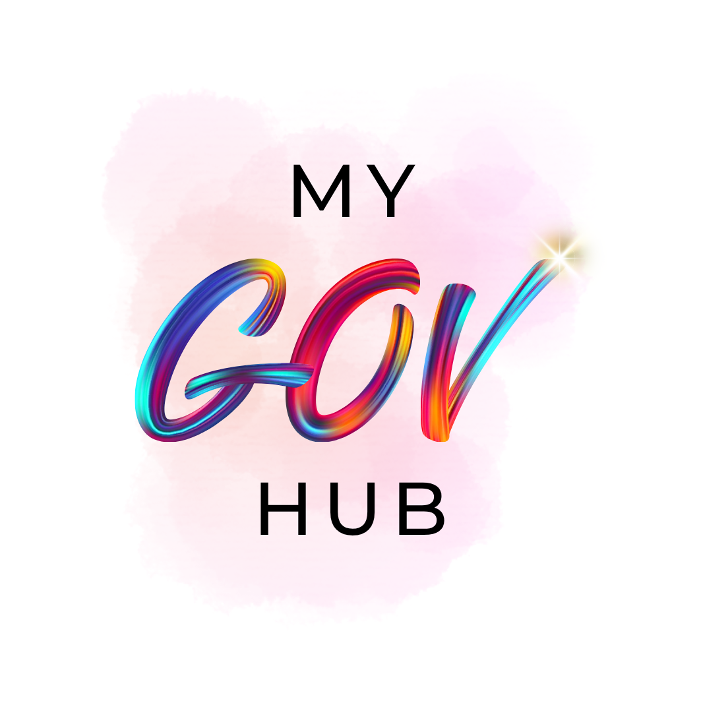
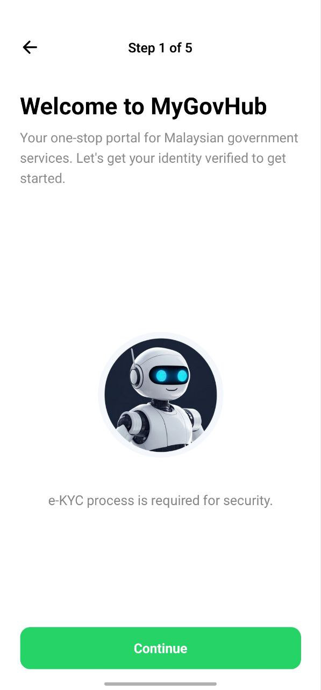
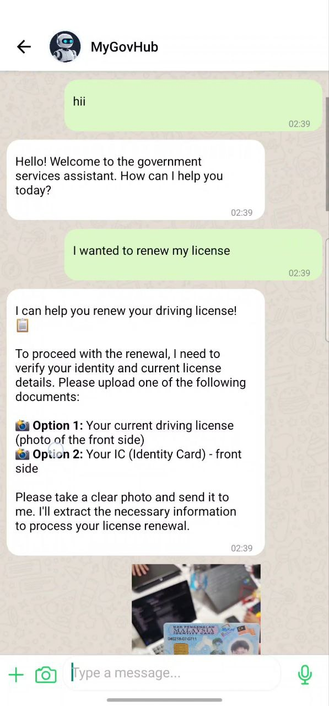
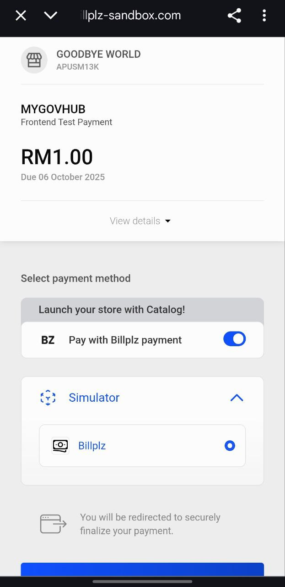
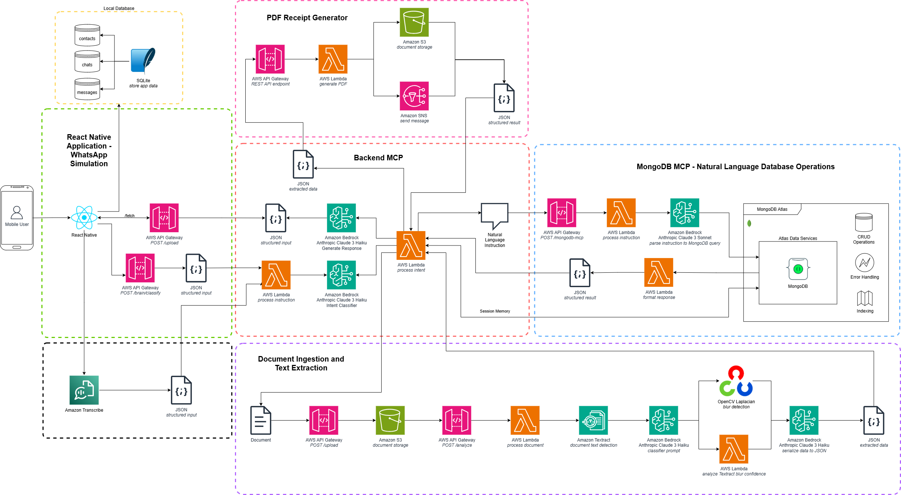

# MyGovHub
  

**A Unified Chatbot for Malaysian Government Services**

 

## Project Overview

**MyGov Hub** is an **AI-powered, unified government services platform** designed to simplify how citizens interact with public services. Instead of juggling multiple apps, citizens access everything through a **single conversational interface,**  text or voice, integrated into familiar platforms like WhatsApp. From renewing licenses to paying summons, or even uploading a photo of a bill, MyGov Hub makes government services **as easy as chatting with a friend**.

## The Problem It Solves

Malaysia currently has nearly **300 and 1500 agency websites/ portals different government apps**, each serving different functions such as license renewals, passport applications, or bill payments. This fragmented system:

- Creates **confusion** and inconvenience for citizens, especially seniors.
- Leads to **duplication and inefficiency**, both for the public and the government.
- Increases **operational costs** for maintaining and managing multiple portals.

MyGov Hub addresses these issues by unifying multiple services into one accessible, cost-efficient, and user-friendly platform.

## Screenshots / Demo

| Onboarding Screen | Chatbot Interface | Payment Integration |
| ----------------- | ----------------- | -------------- |
|      |      |   |

## Key Features

* 🤖 Unified Service Chatbot
* 🔐 Secure In-App Payments (via Billplz)
* 📅 License Renewal Reminders
* ⚡ Real-time Bill Enquiries
* 📎 Document & Receipt Storage (Planned)

## Special Features

- **Conversational AI**: Citizens interact in natural language, making it feel like talking to a helpful assistant instead of navigating rigid menus.
- **Speech-to-Text Integration**: Users can simply speak their requests — enhancing accessibility for seniors and non-digital natives.
- **OCR + GenAI**: Snap a photo of documents like TNB bills, ICs, or summons, and the system automatically processes them, thus proceed for payment.
- **WhatsApp Frontend**: Leverages an existing, widely-used platform to reduce infrastructure costs while ensuring broad accessibility.
- **Scalable SaaS Model**: Offered as a subscription service to government agencies and GLCs, designed to grow and expand sustainably.
- **Cost-Optimized Backend**: Built on serverless and pay-per-use architecture to minimize operational costs and maximize efficiency.

## Tech Stack & Architecture

### Tech Stack

| Layer            | Technology                                    |
| ---------------- | --------------------------------------------- |
| Frontend         | React Native                                  |
| Local Storage    | SQLite                                        |
| Authentication   | Amazon Cognito                                |
| OTP Verification | Amazon SNS                                    |
| Backend          | AWS Lambda (Serverless Microservices), Python |
| Payments         | Billplz API                                   |

### Architecture

> A multi-layered architecture integrating a React Native frontend with MCP powered by Amazon Services, as well as AWS Lambda microservices (Preliminary Round Version).

## My Role & Contributions

**Role:** Team Lead

**Key Contributions:**

* Led overall project strategy and coordinated team efforts
* Architected and developed the primary frontend application using React Native
* Integrated Amazon Cognito and Amazon SNS for eKYC
* Built and deployed serverless backend microservices on AWS Lambda
* Integrated Billplz payment gateway for secure financial transactions

## Project Status

This project is currently under active development. The source code is hosted in a [private organisational repository](https://github.com/MyGovHub-Goodbye-World), which would go public soon. This showcase serves as a comprehensive overview of the architecture, vision, and implementation. 
